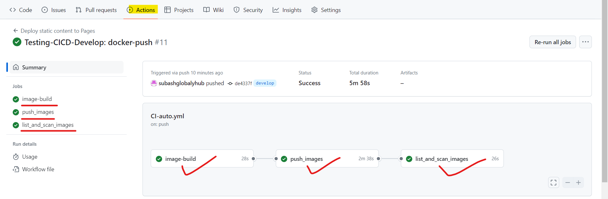

# Table of Contents

- [Table of Contents](#table-of-contents)
- [Repo-description](#repo-description)
  - [Project Description](#project-description)
  - [Init and Setup](#init-and-setup)
 
# Repo-description

It a repository where frontend source code are stored which are developed in react.

## Project Description

- Light/dark mode toggle
- Adding-todo tasks


## Init and Setup
To run this pipeline after saving all changes are perfomed at develop branch follow the following process 
```
git add .
git commit -m "commit message"
git push origin develop
```

Verify pipeline status:



